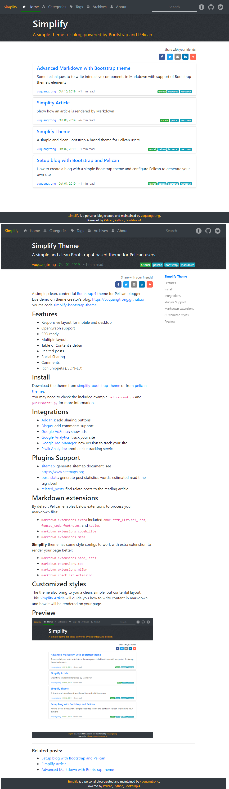

# Simplify Bootstrap Theme
A simple, clean, contentful [Bootstrap 4](https://getbootstrap.com/docs/4.3/getting-started/introduction) theme for Pelican blogger.   
You can use this theme to host programming articles, journals, or galeries.

### Live Demo

Visit the live blog of the theme creator's blog: <https://vuquangtrong.github.io> to see theme in action, which is also has some articles about theme's documents.  
Source code is at [simplify-theme](https://github.com/vuquangtrong/simplify-theme)

### Features

- Responsive layout for mobile and desktop (Bootstrap)
- Quick Search (Tipue Search and/or Google Search)
- OpenGraph (Facebook) and Twitter support
- SEO with contentful metadata, ready for search indexing
- Table of Content sidebar with highlight
- Back to Top floating button in long article
- Related posts, next/previous articles
- Collapsible lists in tags and categories
- Social Sharing (AddThis or direct links)
- Comments on articles (Diqus)
- Rich Snippets (metadata, json-ld, sitemap, robots.txt)

### Install

Download the theme from [simplify-theme](https://github.com/vuquangtrong/simplify-theme) or from [pelican-themes](https://github.com/getpelican/pelican-themes).  
You may need to check the included example `pelicanconf.py` and `publishconf.py` for more information.

### Integrations

- [AddThis](http://www.addthis.com/): add sharing buttons
- [Disqus](https://disqus.com/): add comments support
- [Google AdSense](https://www.google.com.br/adsense/start/): show ads
- [Google Analytics](https://www.google.com/analytics/web/): track your site
- [Google Tag Manager](https://www.google.com/tagmanager/): new version to track your site
- [Matomo](https://matomo.org): formerly [Piwik Analytics](http://piwik.org/): another site tracking service

### Plugins Support

- [sitemap](https://github.com/getpelican/pelican-plugins/tree/master/sitemap): generate sitemap document, see <https://www.sitemaps.org>
- [post_stats](https://github.com/getpelican/pelican-plugins/tree/master/post_stats): generate post statistics: words, estimated read time, tag cloud
- [related_posts](https://github.com/getpelican/pelican-plugins/tree/master/related_posts): find relate posts to the reading article
- [neighbors](https://github.com/getpelican/pelican-plugins/tree/master/neighbors): find next/preivious article
- [share_post](https://github.com/getpelican/pelican-plugins/tree/master/share_post): share article via static buttons if don't use [AddThis](http://www.addthis.com/)

### Markdown extensions

By default Pelican enables below extensions to process your markdown files:

- `markdown.extensions.extra` includes `abbr`, `attr_list`, `def_list`, `fenced_code`, `footnotes`, and `tables`
- `markdown.extensions.codehilite`
- `markdown.extensions.meta` 

**Simplify** theme has some style configs to work with extra extenstions to render your page better:

- `markdown.extensions.sane_lists`
- `markdown.extensions.toc`
- `markdown.extensions.nl2br`
- `markdown_checklist.extension`

### Customized styles

The theme also bring to you a clean, simple, but contenful layout.  
This [Simplify Article](https://vuquangtrong.github.io/blog/simplify-article.html) will guide you how to write content in markdown and how it will be rendered on your page.

### Preview

### How to contribute

Developing Simplify is my effort in some weekends. You are invited to help develop it further.  
Feel free to fork the [repository](https://github.com/vuquangtrong/simplify-theme), and submit pull requests.  
If you find any issues, or have a suggestion, then please open an [issue](https://github.com/vuquangtrong/simplify-theme/issues).

### License

Simplify is released under the [Creative Commons Attribution 4.0 International](https://spdx.org/licenses/CC-BY-4.0.html) license.  
All contributors will be listed in [Authors](AUTHORS.md) page. It maybe imcomplete but it is to honor in all they did.  
I would like you to **have some words to refer to authors work in your page's footer**. Thank you in advanced!
